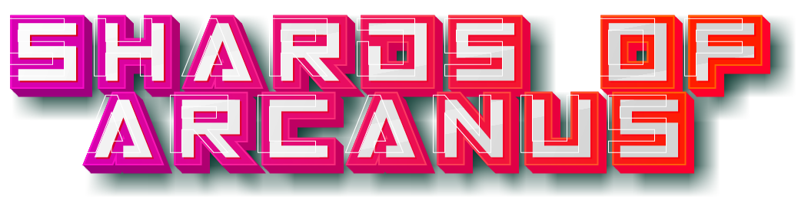

```text
■◤◢◤◢◤◢◤◢◤◢■■■■■■■■■■■■■■■■■■■■■■■■■■■■■■■■■■■■■■■■■■■■◣◥◣◥◣◥◣◥◣◥■
▉▔▔▔▔▔▔▔▔▔▔▔▔▔▔▔▔▔▔▔▔▔▔▔▔▔▔▔▔▔▔▔▔▔▔▔▔▔▔▔▔▔▔▔▔▔▔▔▔▔▔▔▔▔▔▔▔▔▔▔▔▔▔▔▔▉
▉ * .  ┓━┓┳ ┳┳━┓┳━┓┳━┓┓━┓  .  ┳━┓┳━┓┏━┓┳━┓┏┓┓┳ ┓┓━┓ *.       .   ▉
▉  .   ┗━┓┃━┫┃━┫┃┳┛┃ ┃┗━┓ OF  ┃━┫┃┳┛┃  ┃━┫┃┃┃┃ ┃┗━┓      >*<     ▉
▉.     ━━┛┇ ┻┛ ┇┇┗┛┇━┛━━┛ THE ┛ ┇┇┗┛┗━┛┛ ┇┇┗┛┇━┛━━┛  .       *   ▉
▉       .         *          .           *               *       ▉
▉■■■■■■■■■■▶ INFO CENTER ◀■■■■■■■■■■■■■■■■■■■■■■■■■■■■■■■■■■■■■■■▉
▉                                                                ▉
▉   :: GODOT BASED ::                                            ▉
▉   Blobber Style 'Retro' RPG set in a far off world.            ▉
▉                                                                ▉
▉   :: GAME PLAY ::                                              ▉
▉   Explore Areas with your custom party, gather resources, and  ▉
▉   battle against enemies to gain dominance over the area.      ▉
▉   Learn Skills, Spells and level up to advance further.        ▉
▉                                                                ▉
▉   :: SETTING ::                                                ▉
▉   The outer rim has been overrun with corrupted, its your job  ▉
▉   to stop the spread and prevent the kingdom from being over   ▉
▉   run. With friends and foes around every turn you'll need     ▉
▉   your wits and a sharp blade to survive.                      ▉
▉                                                                ▉
▉   :: BUILD STATUS ::                                           ▉
▉   ▉▉▉▉▉▒▒▒▒▒▒▒▒▒▒▒▒▒▒▒▒▒▒▒▒▒▒▒▒▒▒▒▒▒▒▒▒▒▒▒▒▒▒▒▒▒▒▒▒▒ [100%]    ▉
▉       ^10%                                                     ▉
▉▁▁▁▁▁▁▁▁▁▁▁▁▁▁▁▁▁▁▁▁▁▁▁▁▁▁▁▁▁▁▁▁▁▁▁▁▁▁▁▁▁▁▁▁▁▁▁▁▁▁▁▁▁▁▁▁▁▁▁▁▁▁▁▁▉
■◣◥◣◥◣◥◣◥◣◥■■■■■■■■■■■■■■■■■■■■■■■■■■■■■■■■■■■■■■■■■■■■◤◢◤◢◤◢◤◢◤◢■
```

**This project is currently in the early stages of development.**

It aims to provide a `Blobber` Style RPG with a Retro feel. Using traditional D&D inspired mechanics, such as classes, spells, and items, but using a modern twist on the turn based combat approach, you setup a custom party with up to 6 members from various races, each member gets their own class and unique sets of abilities.

## MORE DETAILS

There is a markdown file [WORLD.md](_extra/WORLD.md) that contains a rough outline of the world and the characters that will be a part of the game.

<p align="center">
  
</p>
