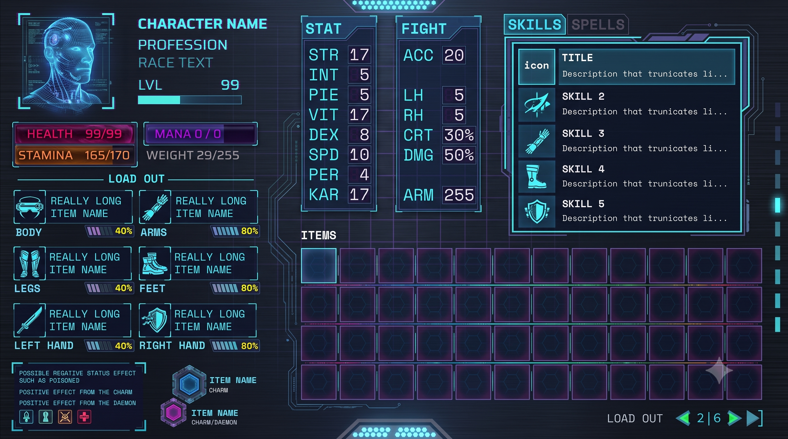

# VENEFEX

---

# LEO | Licensed Energy Obliterators

### MAIN CAST

- You play as members of **L.E.O** aka **The "Cleaners" (Hazardous Arcana Containment):** High-tech urban centers leak raw magic, and unregulated spellcasting leaves "arcane pollution" (ghosts in the server racks, rogue elementals in the plumbing, wild-magic virus outbreaks). The party works for a mid-tier hazard mitigation union.
  - _Why they stick together:_ It pays the rent, and going into a corrupted cyber-dungeon solo is a death sentence.
  - _Why a crew_: Each job has something new and challenging, you need a fighter, a wizard, a healer etc
  - Independent Contractors: You work on a per contract basis. Depending on the danger, that dictates your pay

* **Guild-Corp** : The bureaucracy that hands out the contracts and controls what is or isn’t ‘regulated’ and ‘approved’ uses or arcane technology. Instead of a mustache-twirling villain planning world domination, the underlying mystery is about the **fundamental, systemic truth** about how their job—and the world's techno-magical grid—actually works.
  - In this world, magic and data are intrinsically linked. But the players start noticing **"phantom sectors”**, basically ghost data packets in LEO’s cleaning logs that reference street blocks, historic events, and/or whole families that _do not physically exist_ today.
  - As the game progresses, your GuildCorp point of contact will constantly be cycling through to a new person. (similar to the Dark Arts Prof from Harry Potter)
  - **Quartermaster** Located in the basement of GuildCorps office tower, there is person with a robot assistant that can upgrade your gear, etc.

### Rules & Regulations

- **cybernetic implants** are illegal! However, because they provide such a huge advantage, there is a booming black market for them, and people hide / conceal them. The player will have a chance to upgrade their players with them, but then you will be ostracized, similar to how vampirism works.

- **Monster of the Week Jobs** Standard cleaning gigs. Clear an infected server bank, contain a possessed mechanical gargoyle, handle an illegal street-ware summoner. This gives your players total freedom to enjoy small-scale tactical fights and funny character moments, while slowly realizing that their humble cleaning service is standing right on top of the world's weirdest secret.

- **Magic is regulated.** It leaves a “trail” so casting spells can be detected. Casting spells also is limited the same way running is limited, you only can do it for so long before you collapse. Taking certain chemicals can alter / increase your abilities.

- **AI is Limited**. **Consciousness Altering Technology,** such as transferring your mind into something else is forbidden. Building computers that appear ‘life like’ is forbidden. The more tech focused, the less in tune with magic you are.

### The Vibe / UI | UX

Part Fantasy. Party Cyberpunk. There are ‘computers’ but they are limited. The UI will be heavily ASCII Art inspired, retro DOS style UNIX terminals with ANSI Art. Their world places artificial limits on technology so it has never advanced past a certain point. They also lack high tech foundries required to build really advanced chips, so anything that’s ‘built’ is limited, there are more advanced systems that have been scavenged from the ARC ships but those are of limited supply.

```
▛▔▔▔▔▔▔▔▔▔▔▔▔▔▔▔▔▔▔▔▜▛▔▔▔▔▔▔▔▔▔▔▔▔▔▔▔▔▔▔▔▔▔▔▔▔▔▔▔▔▔▔▔▔▔▔▔▔▜
▮  █     ███   ███  ▮▮ 	ARCANA ▲ 104 XKS ❮ ❁ ❯  6 Ki   ▮
▮  █     █     █ █  ▮▮ 	▶ ███████████████░░░░░░░░░░░   ▮
▮  █     ███   █ █  ▮▮                                    ▮
▮  █     █     █ █  ▮▮     JOB STATUS				30%	    ▮
▮  ███   ███   ███  ▮▮ 	◼ █████████░░░░░░░░░░░░░░░░░   ▮
▙▁▁▁▁▁▁▁▁▁▁▁▁▁▁▁▁▁▁▁▟▮                                    ▮
▛▔▔▔▔▔▔▔▔▔▔▔▔▔▔▔▔▔▔▔▜▮     TIME REMAINING           78%   ▮
▮  ▖▖▖ ▖▄▖▄▖  ▗ ▄▖  ▮▮ 	◐ ████████████████████░░░░░░   ▮
▮  ▌▌▛▖▌▐ ▐   ▜ ▄▌  ▮▮                                    ▮
▮  ▙▌▌▝▌▟▖▐   ▟▖▄▌  ▮▮ 	NEXT OBJ ━┉┉┉┉❪⦗ N | 6k ⦘❫     ▮
▙▁▁▁▁▁▁▁▁▁▁▁▁▁▁▁▁▁▁▁▟▙▁▁▁▁▁▁▁▁▁▁▁▁▁▁▁▁▁▁▁▁▁▁▁▁▁▁▁▁▁▁▁▁▁▁▁▁▟

```

Here is a mockup of the character menu. The one in the game is about 60-70% of the way there. This obv is much more polished.


### The Magic System

- Elemental Based [Fire, Earth, Water, Wind] along with Holy + Darkness. Everything has an opposite. As Above So Below.
- Certain Spells have Stat requirements (such as INT > 16) and only certain professions can learn certain spells.

## Backstory

Everyone on the planet, all the sentient life, arrived there many generations ago, as part of these massive ‘Arcs’ where their original homeworld sent them out into the cosmos to colonize the stars. However, they only have access to some of the advanced tech. As they don’t have the infrastructure they once had. Also no one currently living knows anything about WHY they were put on the arc ships, or where they come from. Space flight is incredibly limited. There are 2 moons that orbit the planet, and there is limited travel from the planet to the surface of the moons. Other planets in the system have yet to be visited by anything besides probes.

#SpaceCats
